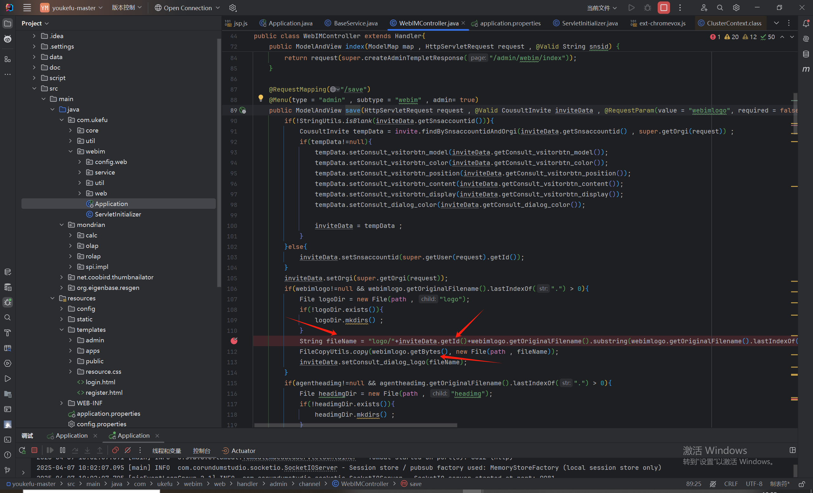
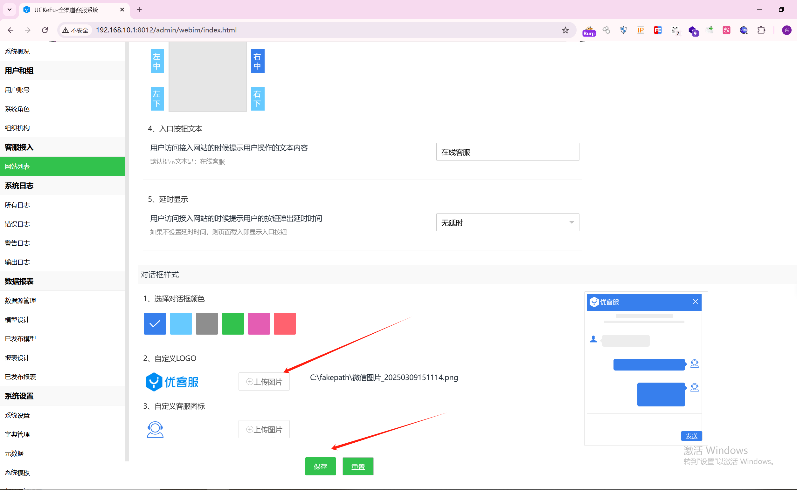
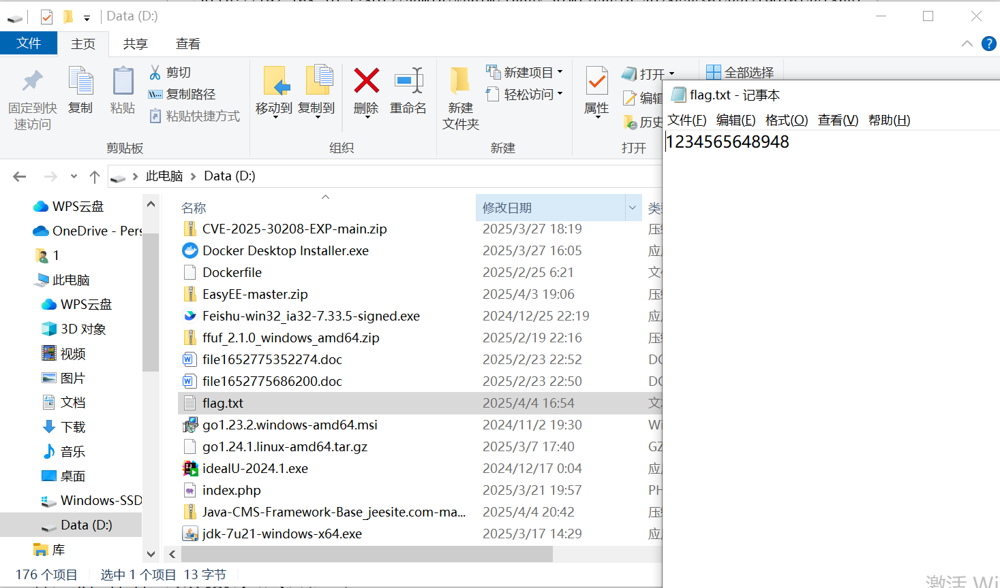
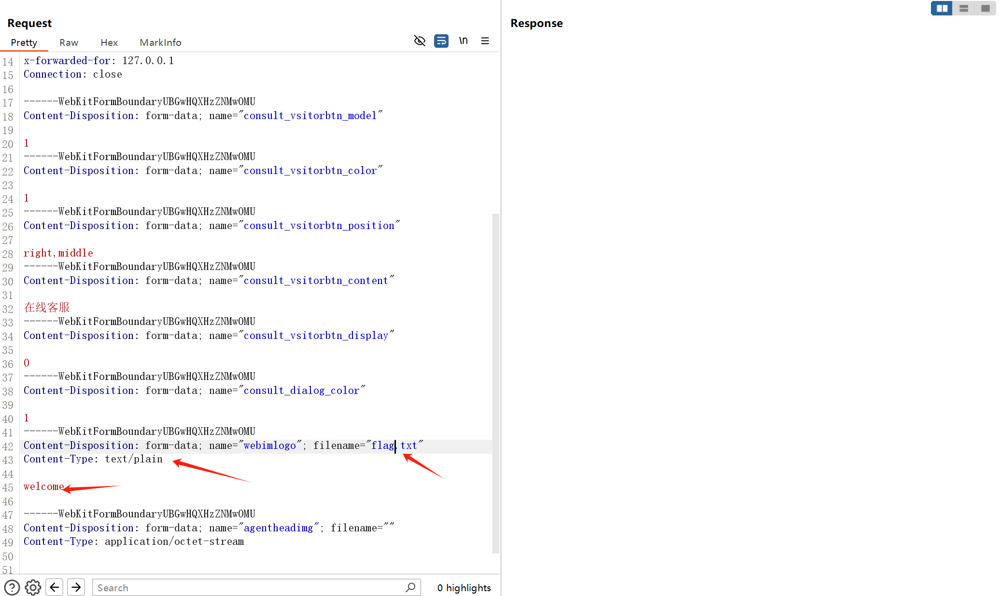
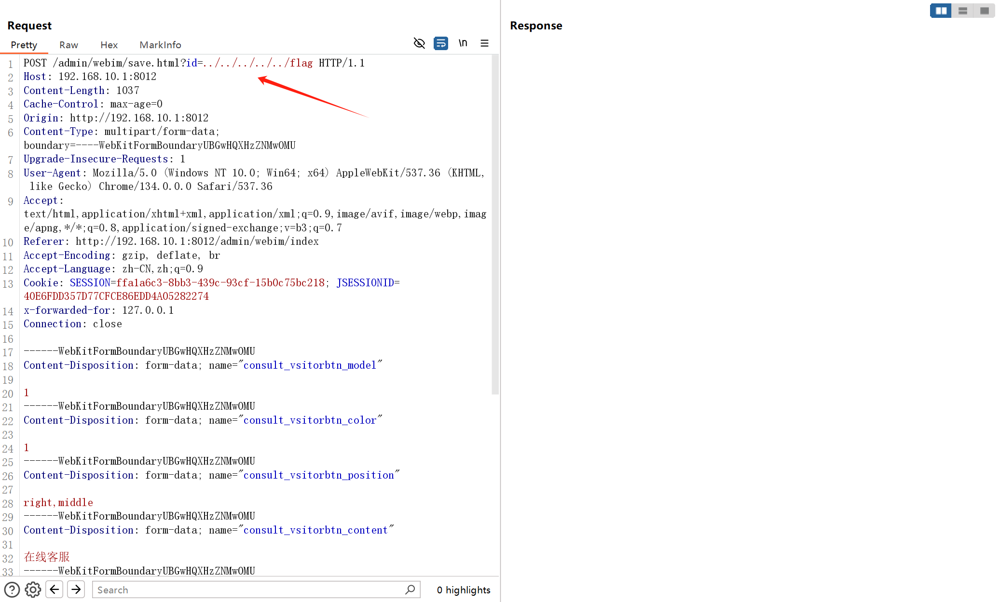
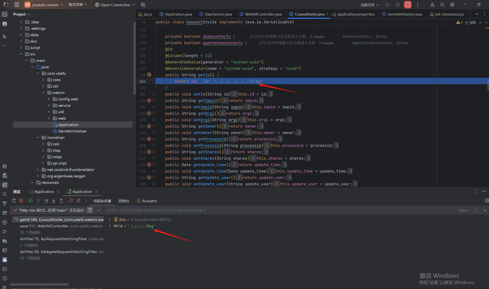
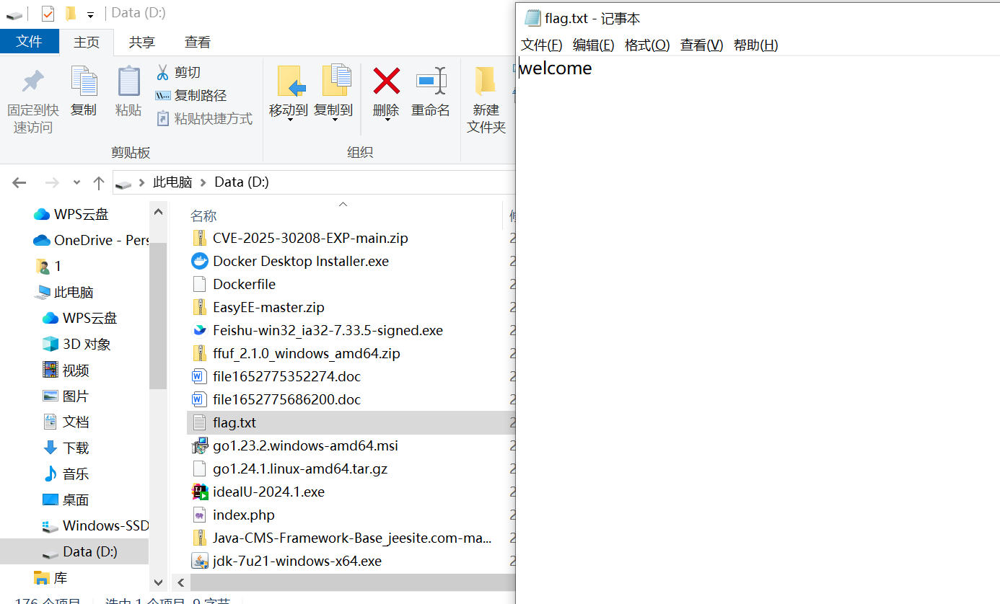

# uckefu-upload

**Youkefu** used improper path concatenation in `WebIMController.java` and failed to perform proper file type validation for uploaded files, leading to an **Arbitrary File Upload** vulnerability.

path：/admin/webim/save.html

The filename was directly constructed by concatenating `"logo/"` with the `id` and other attributes.

Function point:

Target file(source file):

Modify the file type and content in the request packet.

Inject a malicious value into the `id` attribute.

Debugging revealed that the `id` value was successfully assigned.

Successfully overwrote the target file.

This vulnerability can be exploited to overwrite sensitive files such as crontab and SSH configurations for further attacks.
